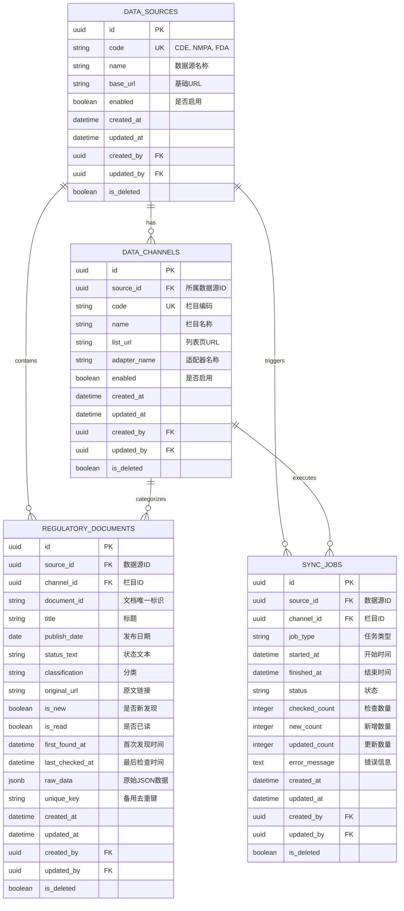

# Regulatory Tracker ER Diagram

## Entity Relationship Diagram



## Constraints

### Unique Constraints

- `data_sources.code`: 数据源编码唯一
- `data_channels(source_id, code)`: 同一数据源下栏目编码唯一
- `regulatory_documents(source_id, channel_id, document_id)`: 同一栏目下文档ID唯一

### Foreign Keys

- `data_channels.source_id` → `data_sources.id` (CASCADE DELETE)
- `regulatory_documents.source_id` → `data_sources.id` (CASCADE DELETE)
- `regulatory_documents.channel_id` → `data_channels.id` (CASCADE DELETE)
- `sync_jobs.source_id` → `data_sources.id` (CASCADE DELETE)
- `sync_jobs.channel_id` → `data_channels.id` (CASCADE DELETE)

### Indexes

- `ix_regulatory_documents_publish_date`: 发布日期索引
- `ix_regulatory_documents_is_new`: 新文档标记索引
- `ix_regulatory_documents_is_read`: 已读状态索引
- `ix_sync_jobs_started_at`: 同步开始时间索引
- `ix_sync_jobs_status`: 同步状态索引

## Data Flow

```
DataSource (CDE)
    ↓
DataChannel (cde_domestic_guideline)
    ↓
RegulatoryDocument (640+ documents)
    ↓
SyncJob (backfill/daily_sync/manual_sync)
```

## Sample Data

### Data Sources
```json
{
  "code": "CDE",
  "name": "国家药品监督管理局药品审评中心",
  "base_url": "https://www.cde.org.cn"
}
```

### Data Channels
```json
{
  "code": "cde_domestic_guideline",
  "name": "国内药品技术指导原则",
  "list_url": "https://www.cde.org.cn/zdyz/listpage/9cd8db3b7530c6fa0c86485e563f93c7",
  "adapter_name": "CdeDomesticGuidelineAdapter"
}
```

### Regulatory Documents (Sample)
```json
{
  "document_id": "9c92f5cfa79fc44da0ac28d2b3a0f6b3",
  "title": "预防用mRNA疫苗临床试验技术指导原则（试行）",
  "publish_date": "2026-06-01",
  "status_text": "颁布",
  "classification": "生物制品",
  "original_url": "https://www.cde.org.cn/zdyz/domesticinfopage?zdyzIdCODE=9c92f5cfa79fc44da0ac28d2b3a0f6b3"
}
```

### Sync Jobs
```json
{
  "job_type": "backfill",
  "status": "success",
  "checked_count": 640,
  "new_count": 640,
  "updated_count": 0
}
```
